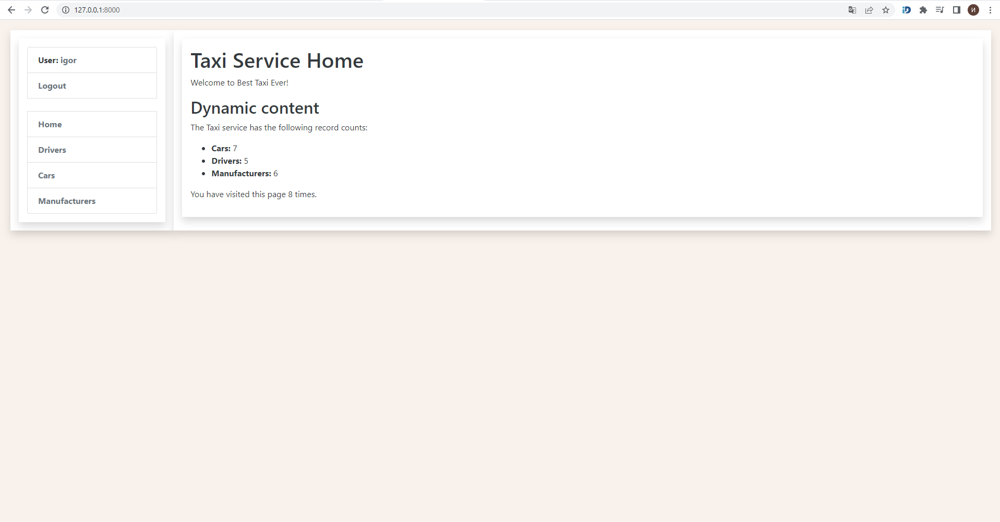

# Taxi-service

This Django project is designed to improve the taxi service. 
Includes a detailed structure that unites all available cars and drivers, 
also is not limited to easy filling of its base.

## Check it out!

[Taxi-service project deployed to Heroku](PASTE_LINK_HERE)

## Installation

Python3 must be already installed

```shell
git clone https://github.com/Igor-Cegelnyk/taxi-service.git
cd taxi-service/
python3 -m venv venv
source venv/bin/activate
pip install -r requirements.txt
python manage.py ranserver  # starts Django Server
```

## Features

* Authentication functionality for Driver/User
* Managing cars drivers & manufacturers cars directly from website interface
* Powerful admin panel for advanced managing

## Demo


